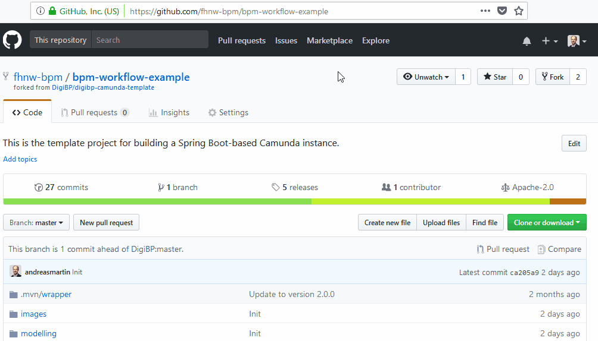
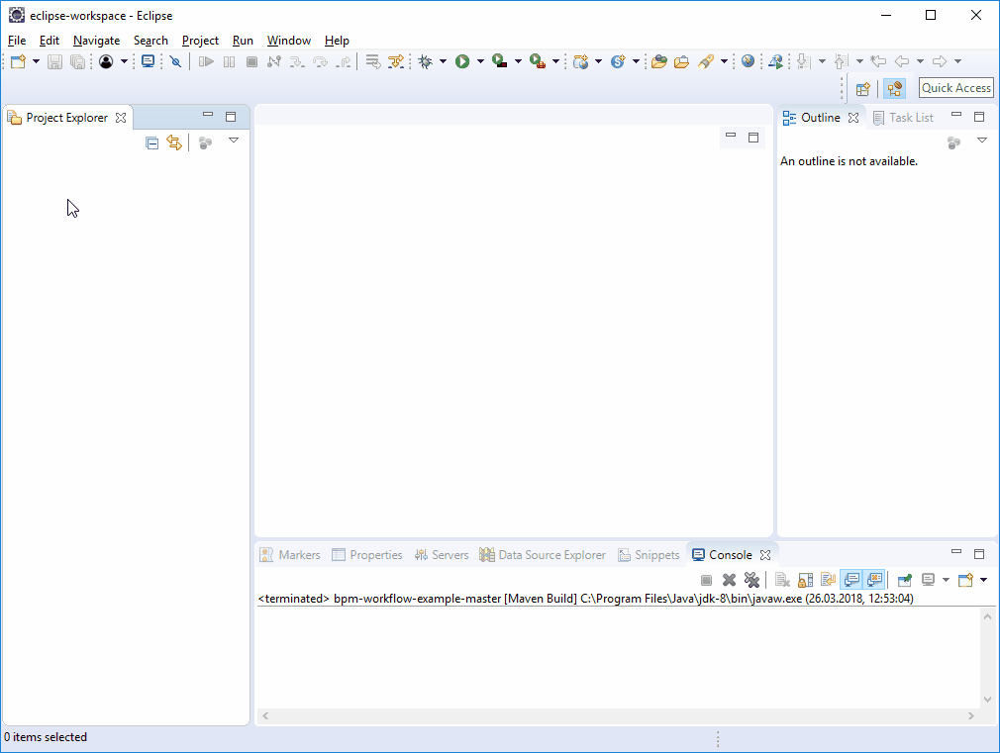
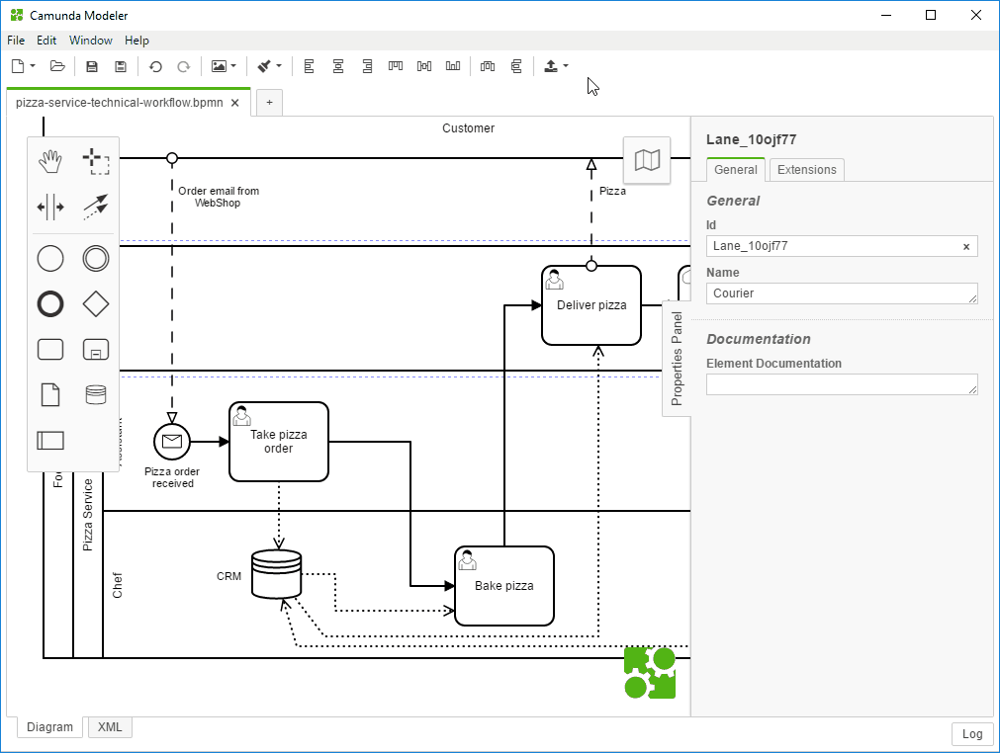
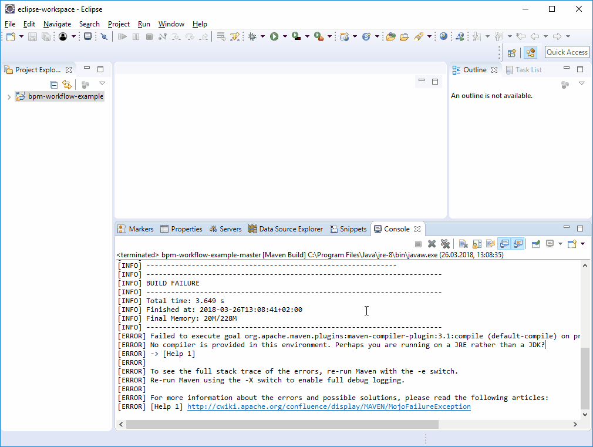

# BPM Workflow Example

[](https//www.apache.org/licenses/LICENSE-2.0.html)
[](https://heroku.com/deploy)

This example project can be used to create a fresh Camunda-based workflow including variables and form fields.

- [1. BPM Workflow Example Project](#1-bpm-workflow-example-project)
- [2. Modelling the Workflow](#2-modelling-the-workflow)
    - [Workflow Modelling](#workflow-modelling)
    - [Model Storage](#model-storage)
- [3. Testing](#3-testing)
    - [Ad-hoc Deployment](#ad-hoc-deployment)
    - [Troubleshooting](#troubleshooting)
- [4. Configuration of Users and Groups](#4-configuration-of-users-and-groups)
    - [Enable Authorisation](#enable-authorisation)
    - [Define Users and Groups](#define-users-and-groups)
    - [Define Authorisations](#define-authorisations)
- [Prerequisites](#prerequisites)
    - [Download Java Development Kit 8 (1.8.0)](#download-java-development-kit-8-180)
    - [Configure JDK in Eclipse](#configure-jdk-in-eclipse)
- [Maintainer](#maintainer)
- [License](#license)

## 1. BPM Workflow Example Project

Download this repository and extract the files:



This repository is a copy of the [digibp-camunda-template repository on GitHub](https://github.com/DigiBP/digibp-camunda-template) and is based on the following structure:


## 2. Modelling the Workflow

Try to model the Food Service process using the Camunda modeller.

> If you just copy existing files, make sure that you create new ids for the process and the messages.

### Workflow Modelling

> You actually have to options how to model this process. You can do it in a waterfall style (model everything until the end) or do it in an iterative style (step-by-step) with use of the [ad-hoc deployment](#ad-hoc-deployment).

Model the process as follows and check `executable`:


You may have to generate a new `message`, if you have a message start event:


Define some form fields (workflow variables) on the start event:


You may want to assign a user group to a user task:


Besides, you also want to reuse the fields (workflow variables) here:


You may want to assign a user group to a user task:


Besides, you also want to reuse the fields (workflow variables) here - form fields can also be made read-only:


You may want to assign a user group to a user task:


Finally, you also want to reuse the fields (workflow variables) here as well - form fields can also be made read-only:


### Model Storage

Save your model under `src\main\resources\modelling` to get collected by the Camunda workflow engine.

## 3. Testing

> To locally run this project using Eclipse, the Java development kit (JDK) must be installed and configured as [described in the prerequisites](#prerequisites).

Compile and run the Camunda Spring Boot microservice:


Once the server has been started, the web-based Camunda web app (tasklist, cockpit, admin) can be requested: [http://localhost:8080/](http://localhost:8080/)

Based on the default configuration in the `application.yaml`, the admin username is `demo`, and the password is as well `demo`.

### Ad-hoc Deployment

Camunda Modeler provides the possibility to deploy models directly from the modelling tool to a running workflow engine. This feature would avoid restarting the engine several times when performing iterative modelling.

> Make sure that your workflow engine is running [as described above](#3-testing).

The configuration and actual deployment of the model can be seen in the following animation:

[]()

It may happen that the model is not valid due to some missing technical configuration. The following animation shows how to deal with a potential error and how such an error can be revealed:

[]()

### Troubleshooting

> Although the Camunda template has been tested carefully, there are some possibilities for error.

Some common errors are: 
- JDK is not correctly installed - see [prerequisites](#prerequisites).
- Port 8080 is already in use by another application. Then try to change to port in the `application-local.yaml` file.
- Maven could not download all dependencies accurately due to network errors. Then try to delete the `.m2` folder in your `users` folder.

## 4. Configuration of Users and Groups

In the following we are going to create some users and groups in the Camunda admin, to reflect the group assignments in the previous workflow modelling stage.

### Enable Authorisation

Per default, the authorisation has been disabled in the Camunda template. Since we are going to use users and groups, the authorisation should be enabled in the `application.yaml` file:

```YAML
camunda:
  bpm:
    admin-user:
      id: demo
      password: demo
    filter:
      create: All Tasks
    authorization:
      enabled: true
```

> Depending on the preferred testing and deployment option. You may have to restart and recompile the Camunda Spring Boot microservice to enable the authorisation.

### Define Users and Groups

First, we are going to create three groups - assistant, chef and courier:


Then we create three users and assign them to the groups - Beppe (assistant), Matteo (chef) and Silvio (courier):


### Define Authorisations

As a next step, we are going to give some rights (authorisations) to the groups and users.

First, we define which group has access to which Camunda application (Resource ID: tasklist):


Then, we define which filter the groups can see in the tasklist:


Next, we define who can do what concerning process definitions:


And finally, the assistant group can start a process (create an instance):


## Prerequisites

The Java Development Kit 8 (1.8.0) must be installed on your machine to run the provided projects containing:
- Camunda Workflow Engine
- Spring Boot

> Note: Currently only JDK version 8 (1.8.0) is supported

### Download Java Development Kit 8 (1.8.0)

If JDK 8 (1.8.0) is not installed on your local machine, then you can download it from [http://www.oracle.com/technetwork/java/javase/downloads/jdk8-downloads-2133151.html](http://www.oracle.com/technetwork/java/javase/downloads/jdk8-downloads-2133151.html). Download and install JDK 8 (1.8.0) for your operating system.


### Configure JDK in Eclipse

You may have to update your installed JRE to JDK in Eclipse:

 

## Maintainer
- [Andreas Martin](https://github.com/andreasmartin)
- [Digitalisation of Business Processes](https://github.com/digibp)

## License

- [Apache License, Version 2.0](https://github.com/DigiBP/digibp-archetype-camunda-boot/blob/master/LICENSE)